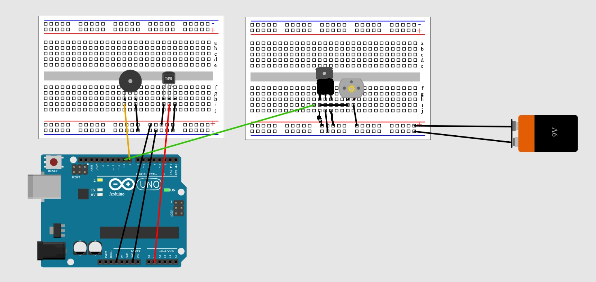
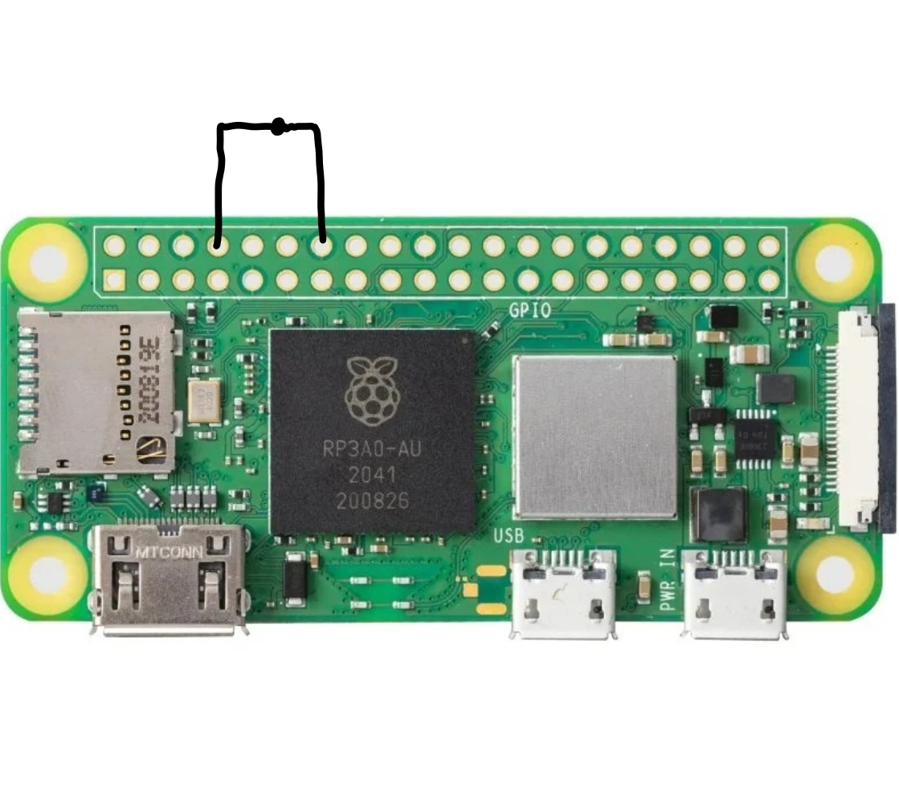

# Home Security Monitoring
<!---
Begin with an introductory paragraph that tells readers the purpose of your solution with hardware and software and its major benefits. 
Give them a summary of the information you will include in this file using clearly defined sections.
-->

The purpose of this project is to design a prototype of an ambient system that will allow at-risk individuals to live independently and safely at home for longer. This is done by integrating software and hardware to monitor home appliances that could be a possible danger if left unsupervised. For this prototype we have implemented monitoring of a stove and a door. The system comes with a webpage that is easy to read and use.

## General Information
<!---
This section expands on the introductory paragraph to give readers a better understanding of your project. 
Include a brief description and answer the question, "what problem does this project solve?"
-->
Our project entails two components focusing on equipment monitoring. The first component is a oven monitoring system. A heat source is used to surveill the oven. If the oven has been on for an extended period a warning will display on a webpage. If the warning is not acted upon, the system will activate a kill switch to turn of the oven. 

The second component is a door monitoring system. Its purpose will be to alert the user if the front door remains open for an extended period. Real-time updates on the status of the door will be displayed on the web-page. To monitor the door, it is used an electric circuit that is closed whenever the door is closed, so that one can detect if there is any current in the circuit or not. 

## Built With
<!---
Include an outline of the technologies in the project, such as hardware components (Arduino/Raspberry Pi), operating systems, programming language, database, libraries.

Include links to any related projects (for example, whether this API has corresponding iOS or Android clients), links to online tools related to the application (such as the project web site, the shared file storage).
If you mention something, please provide links.
-->
### Hardware

* [Raspberry Pi 4 Model B](https://www.raspberrypi.com/products/raspberry-pi-4-model-b/) - 1 unit - Development board for reading sensors and sending this information to our dashboard.
* [Raspberry Pi zero 2W](https://www.raspberrypi.com/products/raspberry-pi-zero-2-w/) - 1 unit - Development board for reading "door input", illustrated through an open/close circuit, and sending this information to our dashboard. 
* [Arduino starter kit](https://store.arduino.cc/collections/kits/products/arduino-starter-kit-multi-language) - Includes a range of the components we used for development. More specifically, we used the following components from the starter kit:
    * Arduino uno
    * Battery 9V
    * Breadboards
    * Buzzer
    * Jumper wires 
    * Motor
    * Resistor 1K ohm
    * Temperature sensor
    * Transistor 
    * USB cable 

* [Nicla Vision](https://store.arduino.cc/products/nicla-vision) - 1 unit - Used for visual monitoring of the stovetop
* Assorted cables:
    * 2 RPi power cables
    * 1 Arduino USB power connector
    * 1 MicroUSB to USB for Nicla Vision

### Software

* [Raspberry Pi OS](https://www.raspberrypi.com/software/) - Operating system
* [Python]() - Programming language for RPi and Nicla Vision
* [Reference]() - Programming language for Arduino
* [Flask]() - Web framework, used for building API
* [React]() - Web framwork, used for building frontend
* [Tailwindcss]() - CSS framework for simplifying design of frontend


## Getting Started

These instructions will get you a copy of the project up and running on for testing purposes.  

1) Set up the physical system according to the circuit drawings. RPi model 4 should be connected to the arduino via USB. While RPi model 2 has the door circuit. Both RPis should be connected to a power source. Connect both RPis to your mobile network.
<!---
Add image of door and motor circuit
-->



    
Camera setup:
    Connect the camera to your computer with a USB cable. A folder will then appear which contains a file called "main.py". Copy the content from that file into OpenMV. Fill in the fields for SSID and KEY with you mobile network name and password. Save the file. Click the connection icon showed in the image below, and then click play. 
        

        
    Now wait for the camera to connect to your network (you will see the camera blinking red while looking for you network). When its connected it will tell so in the terminal, in addition to stop blinking. Navigate via "tools" to find the option that says "Save open script to OpenMN Cam (as main.py)". Eject the device before you pysically remove it. The camera should now have the file installed and can be connected to RPi 4 via USB. 


2) Clone the repository from github using ssh
3) Install required packages (visible under "Software Prerequisities") (not sure if this is needed?)
4) Identify IP adresses for both RPis and the camera: `nmap -sn 172.20.10.0/24`
5) Identify your mobile network name and password. The IP adresses and mobile network information should be added to the file called "network_info.json" in the following format:
```
    {
        "SSID": "",
        "password": "",
        "OvenRPiIP": "",
        "DoorRPiIP": "",
        "CameraIP": ""
    }
```

### Assembly Instructions
<!---

Describe step-by-step assembly instructions.

When necessary, and especially when wiring is involved, include diagrams/photos.

Page for creating diagrams:
https://www.circuito.io/app?components=512,11021,333429

------
####
-->
#### Starting the system when all installments has been done

<!---
Comment from Tuva: This section needs to be updated to include the last changes, not sure how they are (the virtual env and stuff)
--->

Navigate to the folder where you have cloned the github repository. 

Connect to both RPis by writing the following in two different terminals: `ssh g14@<IP address of respective RPi>`

Enter the password: `g14`

In RPi 4 navigate to `/rpi-oven/rpi` and create and activate a virtual environment:
<!---
Add code for creating env
-->
```
python -m venv rPi4env
source rPi4env/bin/activate
pip intall flask flask_cors pyserial
source <name of envirnoment>/bin/activate
```
Run the file for the oven monitoring: `python app.py`
In RPi 2 run the file for the door monitoring: `python door.py`
In a new terminal write: `npm start` in order to start sending images from the camera over the network.


### Software Prerequisites

- OpenMV for programming nicla vision
- Arduino IDE for programming arduino
- Some IDE on your computer to program RPis
- Arduino-cli
- Libraries and dependencies
    - flask
    - flask_corse
    - gpiozero
    - network
    - sensor
    - serial
    - signal
    - socket
    - threading
    - time

- Node package manager

<!---
In this section include detailed instructions for installing additional software the application is dependent upon (such as PostgreSQL database, for example).
Comment from Tuva: Need to add installs for the frontend, i dont know what they are...
-->
```sh
npm install react
npm install --save @fortawesome/free-solid-svg-icons
npm install --save @fortawesome/react-fontawesome
```

### Installation
<!---

Give step-by-step instructions on building and running the application on the testing environment. 

Describe the step.

```
Give the command example
```

And repeat.

```
until finished
```

You can also add screenshots to show expected results, when relevant.
-->

#### Arduino code
Installing arduino-cli is needed to run the arduino code. Navigate to the folder /arduino. Then do the following commands:
```
curl -fsSL https://raw.githubusercontent.com/arduino/arduino-cli/master/install.sh | sh
mv bin/arduino-cli .
chmod a+x arduino-cli
sudo ./arduino-cli core install arduino:avr
sudo ./arduino-cli core search
sudo ./arduino-cli compile --fqbn arduino:avr:uno start_buzzer/
sudo ./arduino-cli upload -p /dev/ttyACM0 --fqbn arduino:avr:uno start_buzzer/
```
Each time you make changes to the .ino file a compile and upload is necessary. This must be done inside the folder /arduino.

If you have issues with this you could try to list the board to check if its name has changed from ttyACM0 to something else, as this happens from time to time: 
`
sudo ./arduino-cli board list
`

For further information about the arduino-cli commands see: https://www.caronteconsulting.com/en/news/how-to/raspberry-arduino-cli/


<!---
### Testing
Comment from Tuva: not sure what should be in here

Explain how to run the tests for this system.

Give users explicit instructions on how to run all necessary tests. 

Explain what these tests do and why

```
Give an example command 
```

## Demo

Give a tour of the best features of the application.
Add screenshots when relevant.
-->

## Additional Information

### Authors

Francisca Silva

Tilde Eine

Tuva Tholo
